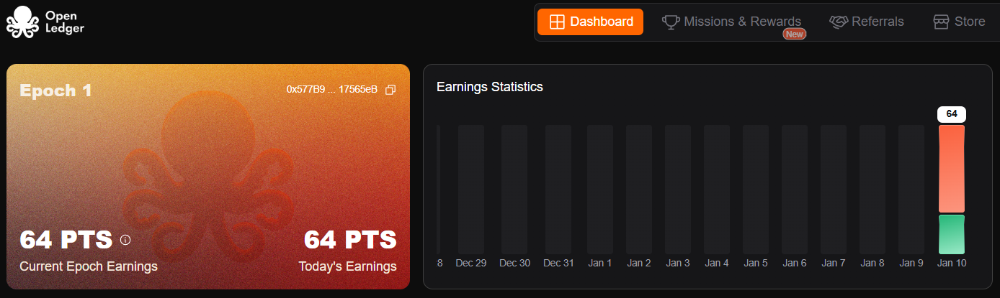
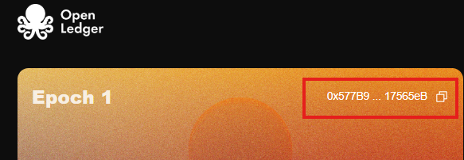

# OPEN LEDGER BOT BY [CRYPTO SATYAM]




- Website [https://openledger.xyz](https://testnet.openledger.xyz/?referral_code=hrlct5soy4)
- OpenLedger Twitter [@OpenledgerHQ](https://x.com/OpenledgerHQ)


## Features

- **Auto Send Heartbeat**
- **Auto Connect/Reconnect Nodes**
- **Auto Claim Daily Rewards**
- **Support Multiple Accounts**
- **Support Proxy Usage (http/socks)**

# LINK JOIN [Join Open Ledger]
 https://testnet.openledger.xyz/?referral_code=hrlct5soy4

Join My Telegram Bhai Log : https://t.me/CryptoSatyam1

## Requirements
- **Register**: [https://testnet.openledger.xyz/](https://testnet.openledger.xyz/?referral_code=hrlct5soy4)
- **Node.js**: Ensure you have Node.js installed.
- **npm**: Ensure you have npm installed.

- **Wallets from open-ledger account**: how to get ???
- **Go To dashboard** [https://openledger.xyz](https://testnet.openledger.xyz/?referral_code=hrlct5soy4) and copy your wallet, look at image below:

   


### Get Free Proxies
- Free Proxies Static Residental: 
1. [WebShare](https://www.webshare.io/?referral_code=p7k7whpdu2jg)
2. Download Free Proxies Copy All Proxy And Convert All In The given Format [Check proxy format below ]
3. If you get error during running just change your proxy format http to protocol which is given below 
## Setup

1. Clone this repository:
   ```bash
   git clone https://github.com/CryptoSatyam/OpenLedger.git
   cd OpenLedger
   ```
2. Install dependencies:
   ```bash
   npm install
   ```
3. Setup: paste you wallet to `wallets.txt` file 1 address per line.
   ```bash
   wallets.txt
   ```

4. Optionally use proxy: paste proxy in the proxy.txt file. 1 proxy per line.
- "It is recommended to use a proxy if you are running multiple accounts."
    ```bash
    proxy.txt
    ```
    format : `protocol://user:password@ip:port`   | or | `protocol://ip:port`


5. Run The Script:
   ```bash
   npm run start
   ```

## 

This project is licensed under the [MIT License](LICENSE).
